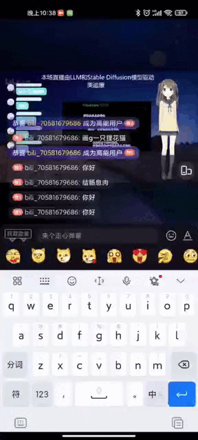

## LLM实现B站虚拟主播

**徐静**

LLM+ Stable Diffusion实现虚拟主播并在B站直播，这里详细介绍需要的环境和实现的代码


### 1.需要的软件环境

+ python环境

```
python=3.11.7

pip install -r requirements
```

+ VTube Studio

1. 下在Stream: <https://help.steampowered.com/zh-cn/login/>
2. 下载安装Steam
3. 注册Steam账号： 最好科学上网选择香港地区，在<https://store.steampowered.com/>注册Steam账号
4. 下载安装Vtube Studio: 登录Steam下载Vtube Studio并安装

+ OBS Studio

下载OBS Studio并安装：<https://apps.microsoft.com/detail/XPFFH613W8V6LV?launch=true&mode=full&hl=fr-fr&gl=cn&ocid=bingwebsearch>

+ 虚拟声卡

我们的代码库中提供了虚拟声卡的安装,解压`虚拟麦克风VBCABLE_Driver_Pack43.rar`并安装。


+ 直播姬

下载安装直播姬： <https://live.bilibili.com/liveHime/>

+ blivechat

装饰直播间： <https://chat.loliloli.moe/>


### 2.TTS模型服务

该服务在项目：`tts_server`中，为了方便我们使用了微软开源的云服务模型。

未来将使用：https://github.com/fishaudio/Bert-VITS2

### 3.LLM模型服务

大模型的云服务模型的调用在`llm_server`中，我们仅提供云服务代码，关于后台大模型使用了langchain和ChatGLM3-6B的chat版本，并使用了TensorRT-LLM做了加速。

### 4.中文Stable Diffusion模型服务

我们使用的模型为： <https://github.com/IDEA-CCNL/Fengshenbang-LM/tree/main/fengshen/examples/finetune_taiyi_stable_diffusion>

我们使用DreamBooth对齐进行了简单的微调。

### 4.装饰直播间

+ VTube Studio生成Live2D虚拟数字人:<Liv2d: https://www.live2d.com/zh-CHS/learn/sample/>
+ OBS虚拟摄像头实现直播间显示stable diffusion生成的图像
+ 弹幕融合到哔哩哔哩直播间：<https://chat.loliloli.moe/>

### 6.直播测试

| Demo1            | Dome1            | 
|------------------|------------------|
|                  |                  |


